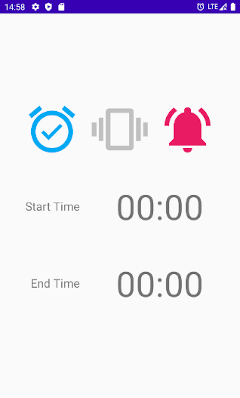

# false-alarm
[中文](README_CN.md)

There is only one alarm time that will alarm at a random time between the start time and the end time. And it will deceive you that it is end time now.

For example, you have to get up at 9 o'clock, but you want to get up early. But you can't because of your laziness. Then, you can set the start time to 6 o'clock and the end time to 9 o'clock. It will alarm at a random time, such as 7 o'clock. And you won't know the real time and consider the worst case. Finally, you will get up 2 hours before the deadline.

## Preview
 
 
 

## Download
* [v1.0](https://github.com/fruit-in/false-alarm/releases/download/v1.0/false-alarm-v1.0.apk)
